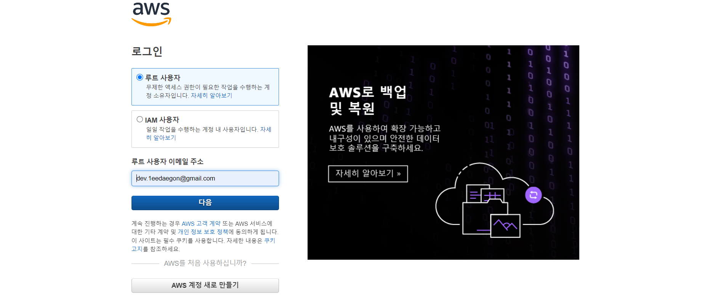
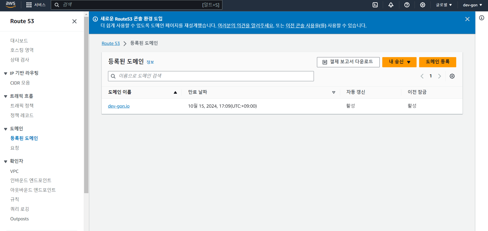
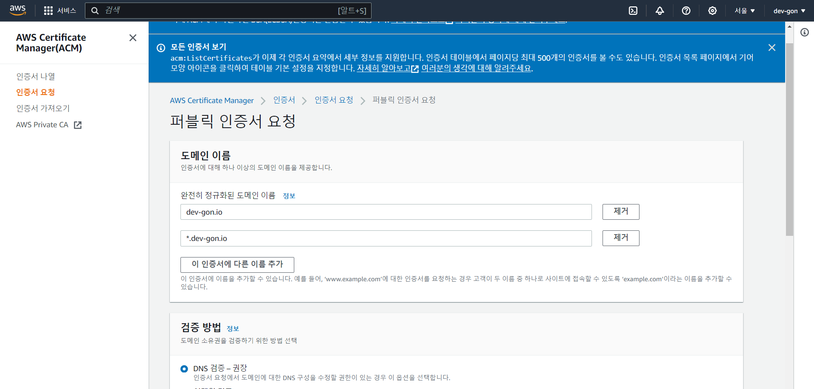
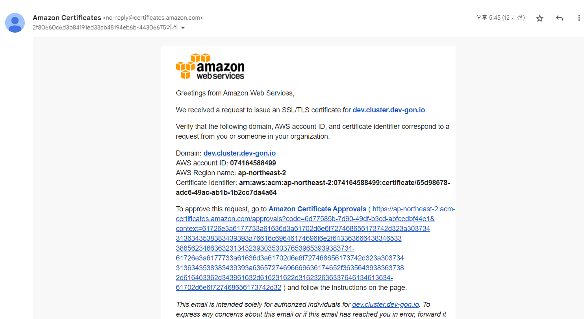
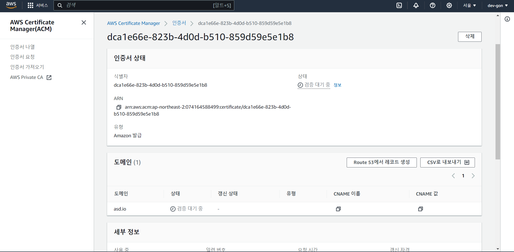
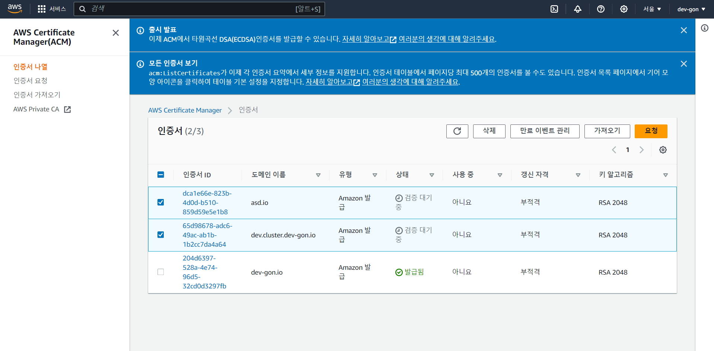

> Doik-2 스터디의 내용을 요약합니다.

kubernetes database operator의 스터디 내용을 공유하기 위해 블로그, EKS 배포를 위한 도메인 이름과 인증서를 발급합니다.

# Route53 사전준비

Route53으로 도메인을 발급하기 전에 aws console 계정을 생성합니다.

- [DOIK-2 0. AWS 계정 및 CLI키 발급](doik2-0-aws-console)

# AWS console 접근

스터디와 블로그를 위해 개인 계정을 발급합니다.
조직에서 발급한 계정이 아니기 때문에 루트 사용자입니다.

# Route53 콘솔 접근, 도메인 생성

[Route53](https://us-east-1.console.aws.amazon.com/route53/domains/home?region=us-east-1#/) `접속 후 도메인 > 도메인 등록`

도메인을 발급해줍니다.

저는 이미 발급을 진행했습니다.

가격이 비싼데 왜 AWS에서 하냐고 물으시면

- 도메인에 연결된 인증서의 갱신을 자동으로 수행하지 않을 수 있고(자동으로 하려면 따로 만들어줘야 함)
- 나중에 규모가 커졌을 때 AWS로 도메인을 전환하려고할 때 복잡한 절차를 보고 후회하실 수도 있습니다.
- 물론 소규모로 제한하려면 다른 곳에서 발급하시면 됩니다.(개인적으로 연간 70000원이면 손해는 아니라고 생각함)

도메인과 인증서에 관련된 내용은 추후에 따로 포스팅하겠습니다.

# ACM 콘솔 접근, 인증서 발급

[AWS Certificate manager](https://ap-northeast-2.console.aws.amazon.com/acm/home?region=ap-northeast-2#/certificates/list)
접속 후 `인증서 나열 > 요청`

퍼블릭 인증서 요청

그림과 같이 2개 이상을 넣어줍시다.

예를들어 발급해야할 도메인이 `example.com` 이면 아래와 같이 입력합니다.

- `example.com`
- `*.example.com`

`dev.example.com` 같이 서브도메인에 대해 사용하고싶은데 일부 인증서 vendor들은 해당 인증서를 별도로 구입하라고 가이드하니 주의합니다.

검증 방법은 `DNS 검증`을 선택합니다.

`이메일 검증` 시 아래와 같은 이메일이 옵니다.

# ACM Console 인증서 Route53 레코드 생성

인증서를 발급 후 DNS 레코드를 갱신해야합니다.

아래 보이는 `Route53에서 레코드 생성` 요청을 진행합니다.

인증서 등록, 레코드 적용까지 5분정도 소요됩니다.

인증서 발급이 완료되면 아래 사진과 같이 `검증 대기 중`에서 `발급됨`으로 변경됩니다.

